<p align="center">
  <a href="https://movievault.ashwin.co.in">
    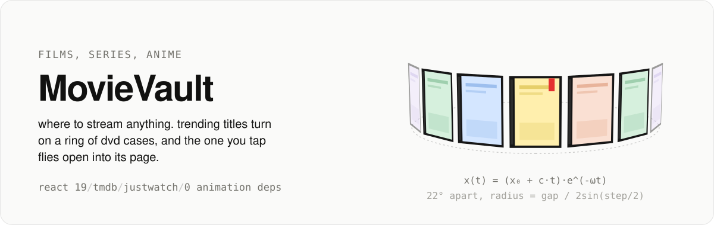
  </a>
</p>

<p align="center">
  <a href="https://movievault.ashwin.co.in"><strong>movievault.ashwin.co.in</strong></a>
  &nbsp;·&nbsp;
  <a href="#what-it-does">what it does</a>
  &nbsp;·&nbsp;
  <a href="#the-reel-is-maths-not-a-dependency">the reel</a>
  &nbsp;·&nbsp;
  <a href="#running-it">running it</a>
</p>

<br>

<p align="center">
  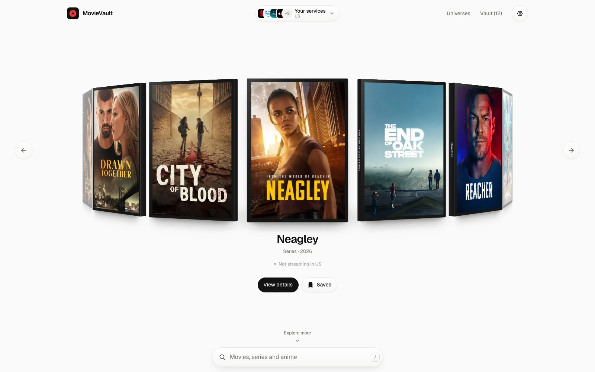
</p>

the source of **[movievault.ashwin.co.in](https://movievault.ashwin.co.in)**. search any film, series, anime or person, see which of your services a title streams on tonight, follow a whole franchise in release order, and keep a vault of what to watch next.

it is a react spa with no server behind it, talking straight to tmdb. the routes are not the interesting part. the interesting parts are the reel, which is a spring solved by hand rather than a dependency, and the case you tap, which is the same case that opens on the next page.

## what it does

| route | what it is |
| --- | --- |
| `/` | the reel of what is trending, and shelves of what is popular on your services |
| `/search` | one search across films, series, anime and people, with genre, language, length and free-to-watch filters. paste an imdb link and it finds the title |
| `/movie/:id`, `/tv/:id` | the case, opened: where to watch, cast, crew, trailer, seasons, and what came before and after it |
| `/universes` | eighteen franchises as a grid of backdrops |
| `/universe/:slug` | one franchise as a release-order timeline, with one tap to save all of it |
| `/person/:id` | an actor or director: what they're known for, and every credit in order |
| `/company/:id`, `/network/:id` | everything from a studio or network, like a24 or hbo |
| `/keyword/:id` | everything tmdb tags with a theme, like time travel or heist |
| `/vault` | everything you saved, with where each one streams |

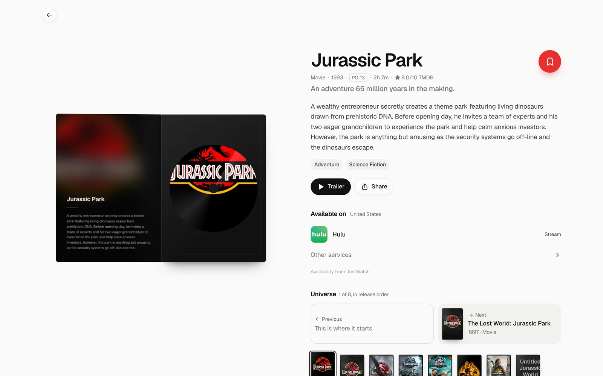

- **where to watch.** every title lists the services it streams, rents or sells on in your region, with the ones you pay for first. the data is justwatch's, through tmdb.
- **your services.** pick them and your region once. home shows what is popular on them, and search can narrow to only what you can watch tonight.
- **anime is its own thing.** tmdb has no anime type, so it is recognised through tmdb's anime keyword and gets its own shelf and filter.
- **connected titles.** every detail page shows what came before and after it in release order, for films, series and anime alike, with a strip of the whole franchise and a link to its universe.
- **episode ratings.** every series has a ratings graph in the style of a contribution chart: one row per season, one square per episode, darker for better. a season too long to read as one row, like the 366 episodes in bleach's first, is split into its arcs using tmdb's fan-made episode groups, or at the gaps between broadcast seasons when there are none.
- **when it lands.** films between cinema and streaming show their digital release date for your region, on their page and as a "digital 29 sep" badge on cards and in the vault.
- **people.** cast, directors and writers link to their own pages, and search finds them too.
- **episodes up close.** tap an episode for its still, rating, director, writers, guest stars and clips, and step through the season from there.
- **every video.** the trailer opens with the teasers, clips, featurettes and behind-the-scenes videos lined up underneath.
- **studios, networks and tags.** the details show studio and network logos, and those and a title's tags each open a page of everything else under them.
- **what's new.** home shows new episodes of series in your vault, what's in cinemas near you, and what just came out on digital.
- **anime numbering.** anime that restart their episode numbers each season also show the running number, so season 2 episode 1 reads as #26.
- **links out.** imdb, wikipedia, the official site and socials, where tmdb knows them.
- **the vault.** save anything with a bookmark, filter it, sort it, and undo a removal from the toast.
- **watch apps.** turn on nuvio or stremio in settings and title pages get a button that opens the title there.
- **your language.** titles, descriptions, posters and logos can come from tmdb in your language. the app itself stays in english.
- **settings.** appearance, language, watch apps, and the live tmdb connection. the gear carries a dot when that connection is down.
- **light and dark.** follows the system unless you pick one.

## the reel is maths, not a dependency

every case sits on a ring. its angle is its offset from the front times a fixed step, 30° on narrow screens and 22° from 720 px up, and the radius falls out of the case width so neighbours never overlap:

```js
radius = gap / (2 * Math.sin(step / 2)) // gap = 1.1 × case width
```

the ring's position eases toward its target on a critically damped spring, solved in closed form rather than stepped, so a long frame never makes it overshoot:

```js
const decay = Math.exp(-w * dt);
const c = v0 + w * x0;
pos = target + (x0 + c * dt) * decay;
vel = (v0 - w * c * dt) * decay;
```

everything else follows from that.

- **one spring, two feels.** a drag, a key or a tap sets `w` to 15, so the ring snaps. autoplay sets it to 6.5, so it glides.
- **flicks carry.** release velocity comes from the last 90 ms of pointer samples rather than the last two events, goes straight into the spring as its starting velocity, and can carry the ring at most five cases.
- **nothing renders per frame.** transforms go straight to the node. react only hears about it when the case in front changes.
- **it stops when it stops.** once the ring is within 0.0006 of a case and barely moving, the rAF loop ends and the position is saved for the session, so coming back puts you where you were.
- **autoplay waits its turn.** it holds while you hover the ring or the caption under it, while a case has focus, while the tab is hidden, and while less than 35% of the reel is on screen.
- **a small ring to draw.** only the cases within 3.6 steps of the front are painted, and the outer ones fade from 2.3 steps out.

## the case that opens is the case you tapped

tap the front case and it does not cross-fade. one case, drawn above both pages, flies from the reel to where the detail page will put it, swings open to show the disc, and hands over to the real one.

it is a flip done with the web animations api. the page it lands on is not mounted yet when it takes off, so it flies to a probed layout box and **steers** onto the real one once it exists. going back, it closes and flies home, but only if home is where you actually came from: the take-off rect is stored with its history index and the viewport width, and if either no longer matches, it waits for the page to place its case and flies there instead, or simply fades if there is nowhere to land. a modifier click on a card skips all of it and opens a tab, and reduced motion skips all of it outright.

every other navigation goes through the view transitions api, through react router's data router.

## requests are honest about failing

there is no data fetching library either. `useQuery` is 99 lines.

- **a cache that remembers.** results live for ten minutes in memory and in `sessionStorage`, so going back paints at once. results stay on screen while new ones load, so nothing flashes empty.
- **retries that back off.** a failed request tries three times, waiting 400 ms and then 1 s, plus jitter. a rejected key or a 404 does not retry, because it will not get better.
- **a pill only when it is true.** the app watches the requests it really makes, not a ping. the status pill only appears when tmdb is unreachable, you are offline, or the key is wrong, and its retry button replays every query that failed.

<details>
<summary><strong>more screenshots</strong></summary>

<br>

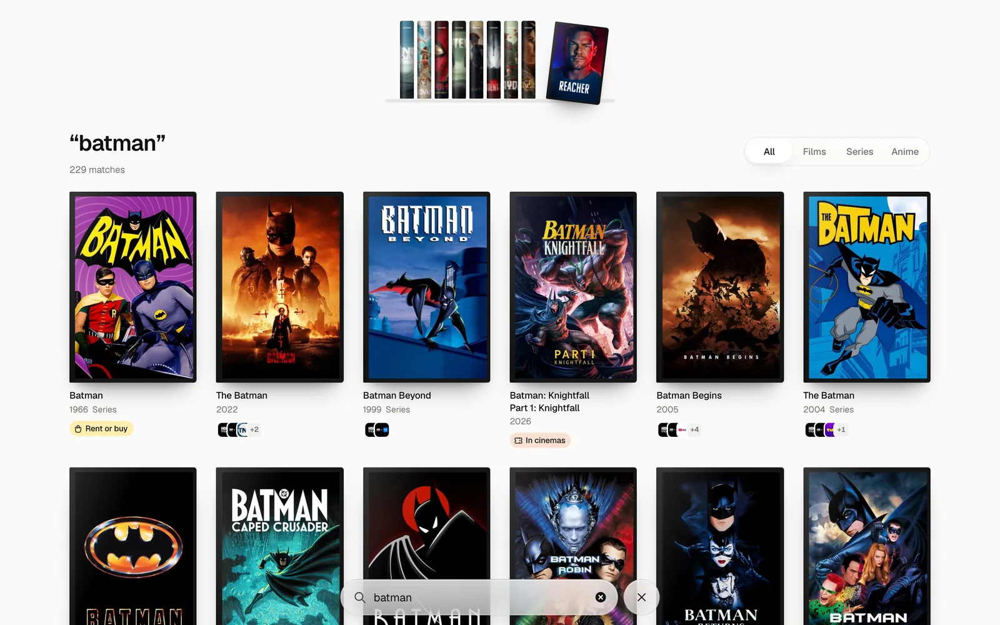

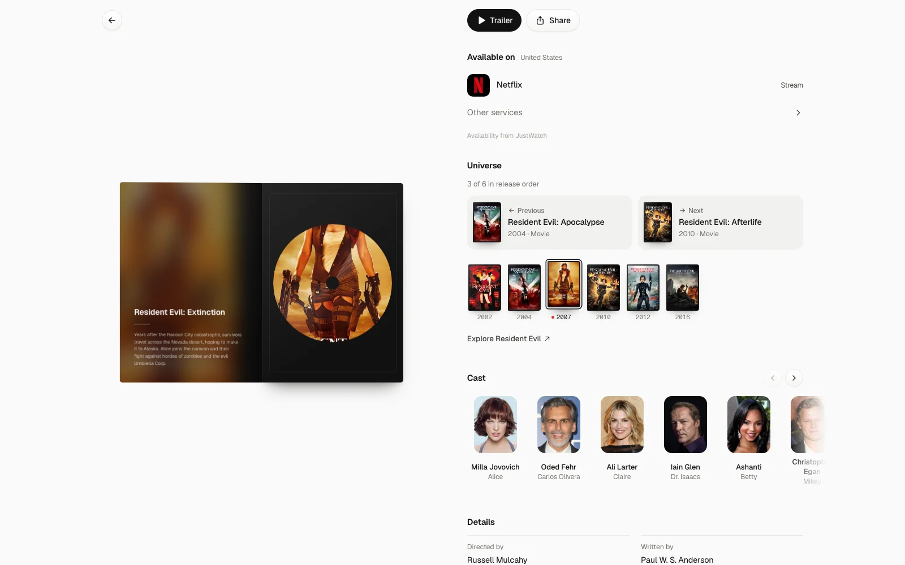

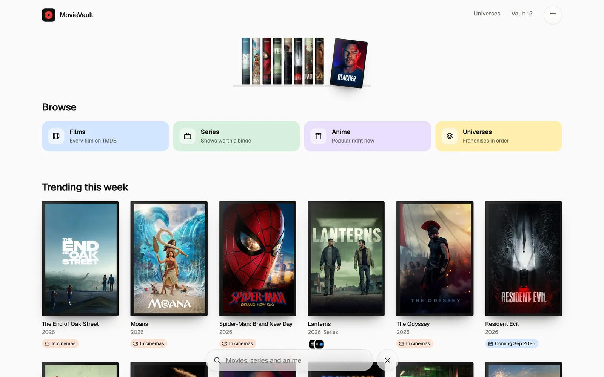

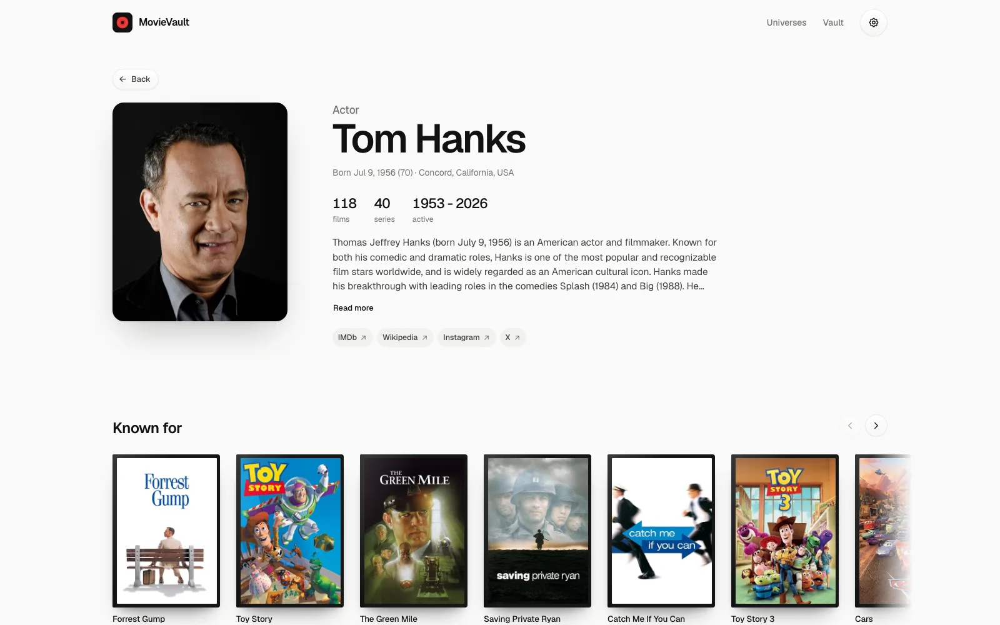

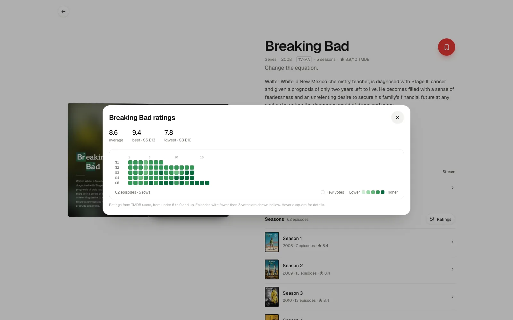

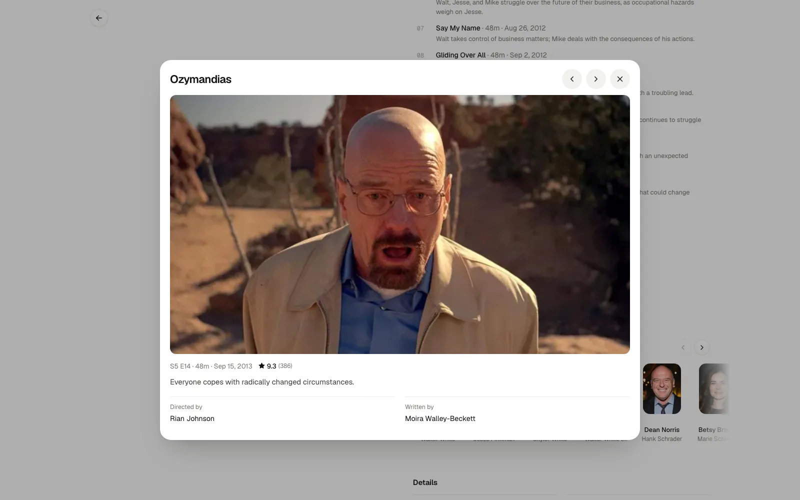

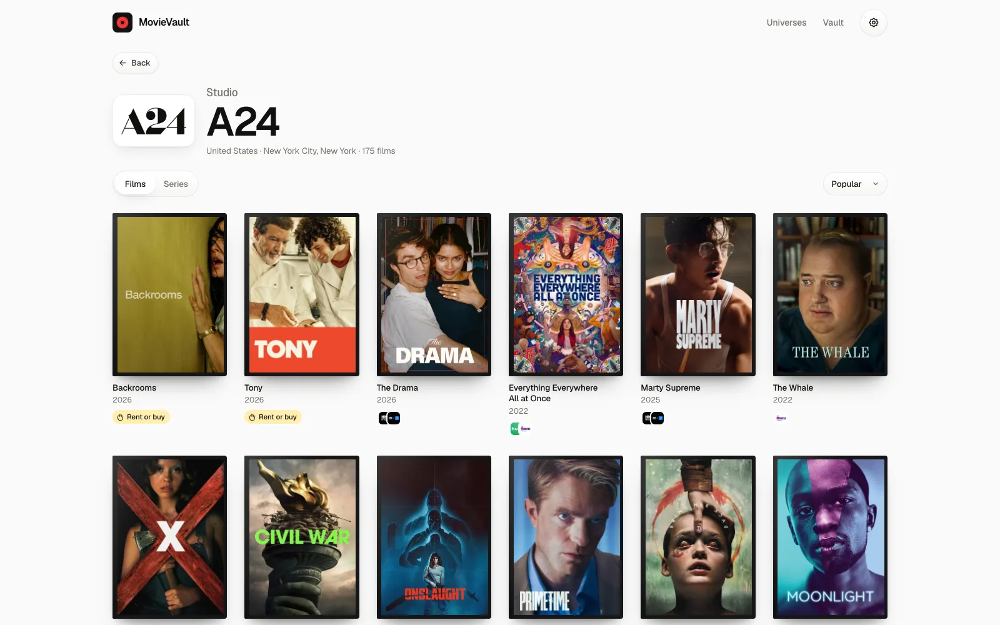

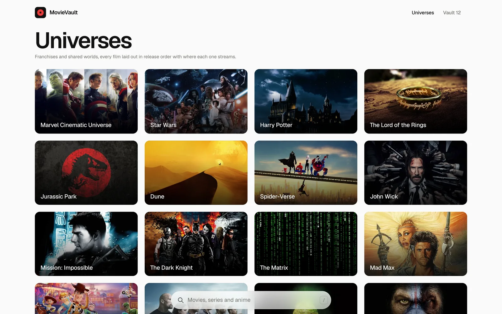

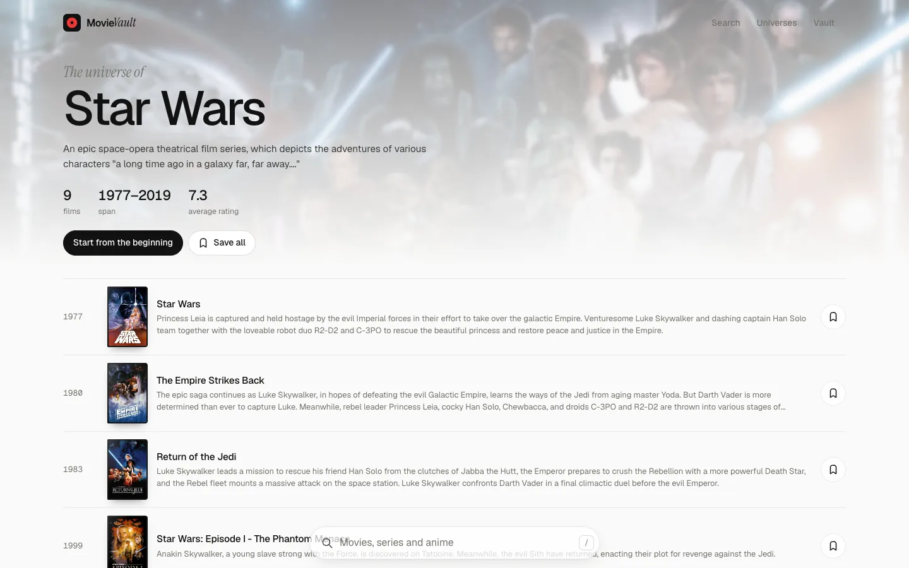

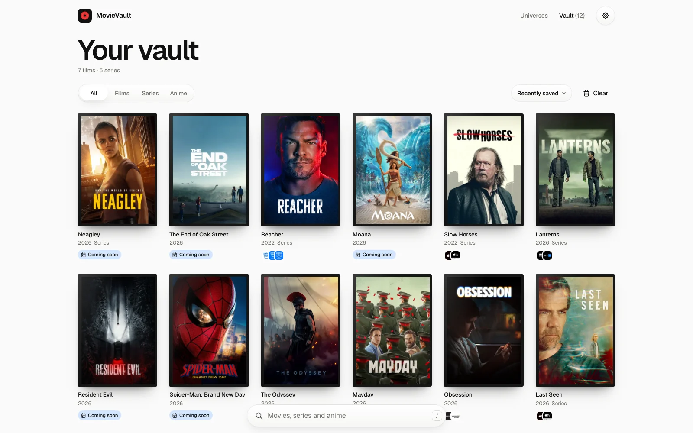

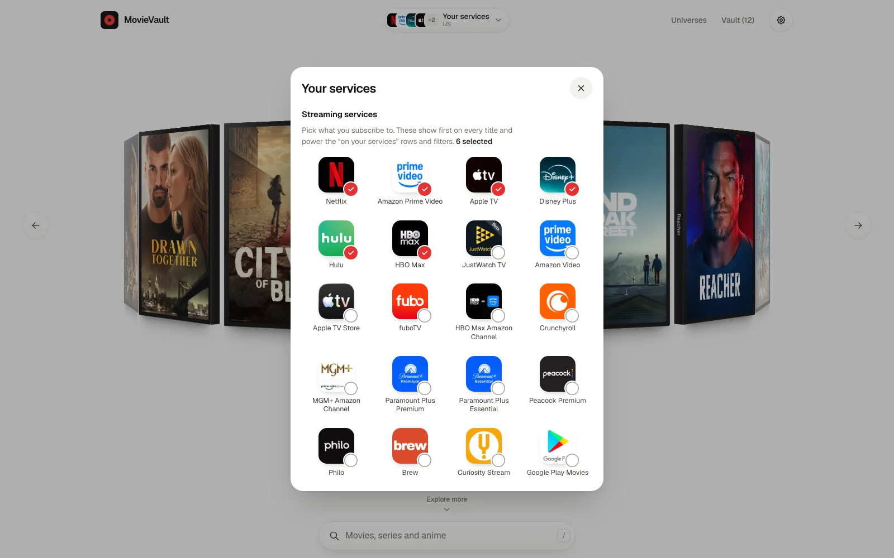

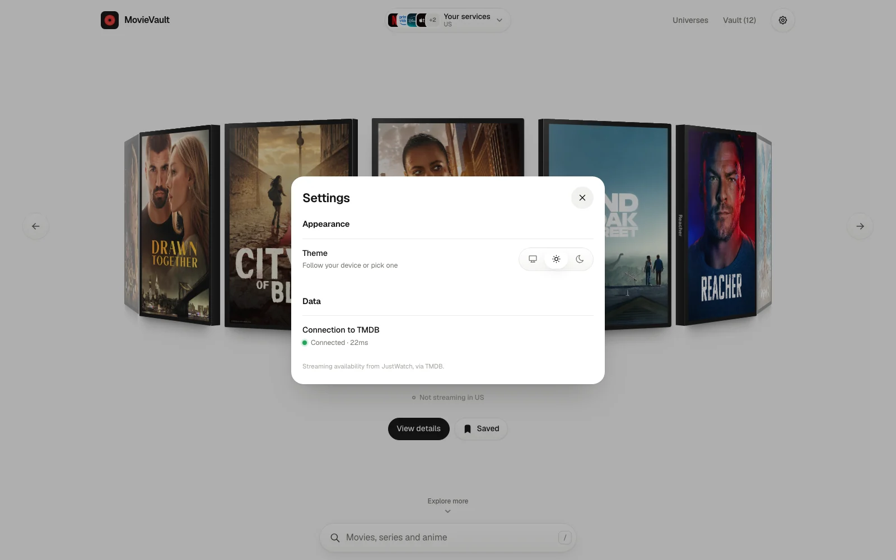

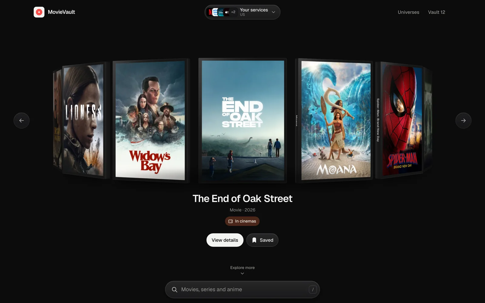

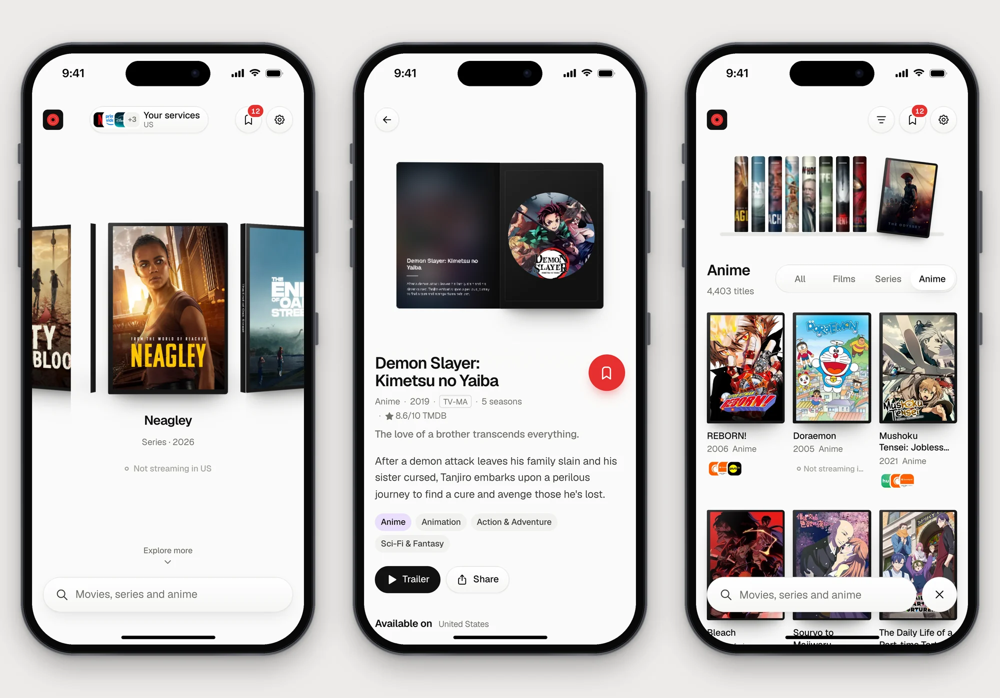

</details>

## the design

- **restraint.** a warm off-white ground, near-black ink, one red for saving, and pastel chips for browsing.
- **one family.** geist for everything, geist mono for small numbers like years.
- **phones first.** a search dock that rides above the keyboard, sheets you drag to dismiss, 44 px touch targets and safe-area padding, scaling up to a two-column detail page and a wider ring.
- **calm loading.** skeletons match the real layout and share one synchronised sweep, and images fade in rather than pop.
- **accessible.** keyboard navigation throughout, focus held inside dialogs, and `prefers-reduced-motion` respected everywhere.

## the stack

| layer | choices |
| --- | --- |
| framework | [react 19](https://react.dev/) · [react router 8](https://reactrouter.com/) data router, for view transitions and scroll restoration |
| styling | [tailwind css 4](https://tailwindcss.com/) for the reset, then one hand-written, token-based stylesheet · [tabler icons](https://tabler.io/icons) |
| data | [tmdb api](https://developer.themoviedb.org/docs/getting-started) for titles, providers, collections, credits, seasons and videos · availability from [justwatch](https://www.justwatch.com/) |
| tooling | [vite 8](https://vite.dev/) · [biome](https://biomejs.dev/) · a pre-commit hook · github actions |

no animation library, no data-fetching library, no state library. the reel, the flight, the sheets, the toasts, the cache and the stores are small modules in `src/lib` and `src/components`.

## running it

you'll need node 22.22+ and a free [tmdb api key](https://www.themoviedb.org/settings/api).

```sh
git clone https://github.com/Ashwin-S-Nambiar/MovieVault.git
cd MovieVault
npm install
```

put the key in a `.env` at the root:

```env
TMDB_API_KEY=your_api_key_here
```

```sh
npm run dev        # http://localhost:5173
npm run check      # lint, format and import order
npm run check:fix  # apply the safe fixes
npm run build && npm run preview
```

a pre-commit hook runs biome on staged files, and ci runs `biome ci` and the build on every push and pull request.

## the shape of it

```
src/
  components/  the reel, cases, the flight, services and settings sheets,
               toasts, the status pill, shelves, cards, the seasons list,
               the ratings graph, the episode sheet
  lib/         tmdb client and catalogue, the query cache, health, stores,
               hooks, the hero flight, episodes and their splits, universes
  pages/       home, search, title, person, studio, network and tag
               browsing, vault, universes, universe, not found
  index.css    tokens, themes, then every component, in one file
```

## known rough edges

- **mostly one bundle.** the app ships as one chunk, about 145 KB gzipped. only the ratings graph and the episode sheet are split out, and they load when you open them.
- **no server rendering**, so the page is empty until react mounts.
- **the key is public.** a tmdb key sits in the client bundle, as it does in any static tmdb app. the app only ever reads with it, and nothing you do here is sent anywhere but tmdb.
- **universes are hand-picked.** the eighteen franchises are a list in [`src/lib/universes.js`](src/lib/universes.js), not something tmdb exposes.

## credit

this product uses the tmdb api but is not endorsed or certified by tmdb. streaming availability is provided by justwatch.

---

[movievault.ashwin.co.in](https://movievault.ashwin.co.in) · [ashwin.co.in](https://ashwin.co.in) · [notes](https://notes.ashwin.co.in) · [x](https://x.com/ashwinnambiar11) · [github](https://github.com/Ashwin-S-Nambiar)
