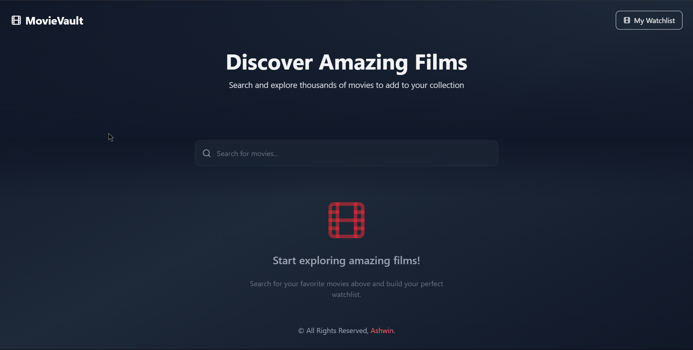
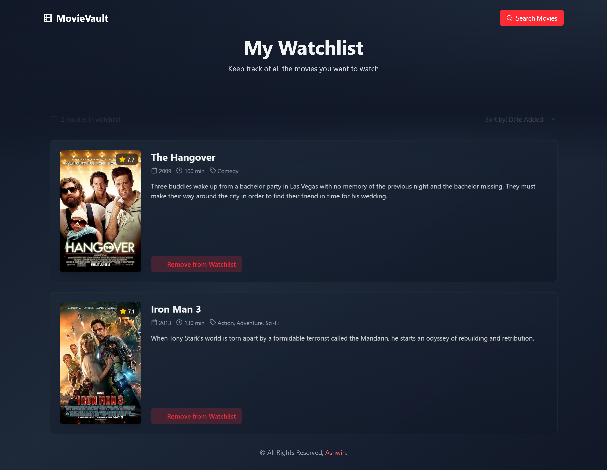

# 🎬 MovieVault

**Live:** [https://movie-watchlist-fawn-three.vercel.app/](https://movie-watchlist-fawn-three.vercel.app/)

**Description:**  
MovieVault is a user-friendly web application designed to help film enthusiasts discover movies and curate a personalized watchlist. By leveraging the [OMDb API](https://www.omdbapi.com/), users can search for films, view detailed information, and manage their watchlist efficiently.

## 🚀 Features

- **Search Functionality:** Quickly find movies by title using the integrated search feature.
- **Detailed Movie Information:** Access comprehensive details including plot summaries, release year, genre, and more.
- **Personalized Watchlist:** Add or remove movies from your watchlist to keep track of what you plan to watch.
- **Responsive Design:** Enjoy a seamless experience across various devices, thanks to a fully responsive layout.
- **Smooth Animations:** Experience fluid transitions and animations powered by Framer Motion.

## 🛠️ Tech Stack

- **Frontend:**
  - [React](https://reactjs.org/): A JavaScript library for building user interfaces.
  - [React Router](https://reactrouter.com/): Declarative routing for React applications.
  - [Tailwind CSS](https://tailwindcss.com/): A utility-first CSS framework for rapid UI development.
  - [Framer Motion](https://www.framer.com/motion/): A library for animations and gestures in React.
  - [Vite](https://vitejs.dev/): A fast build tool and development server for modern web projects.

- **API:**
  - [OMDb API](https://www.omdbapi.com/): A RESTful web service to obtain movie information.

## 🛠️ Installation and Running Locally

To run the application locally, follow these steps:

1. **Clone the Repository:**

   ```bash
   git clone https://github.com/Ashwin-S-Nambiar/MovieVault.git
   cd movie-watchlist
2. **Install Dependencies:** Ensure you have **Node.js** installed. Then, install the required packages:

   ```bash
   npm install
3. **Obtain OMDb API Key:**   
     - Visit the OMDb API website to request a free API key.
     - Create a `.env` file in the root directory and add your API key:

        ```
        VITE_API_KEY=your_api_key_here
        ```
4. **Start the Development Server:** 

   ```bash
    npm run dev
    ```
   **The application will be accessible at `http://localhost:5173`.**

## 🤝 Contributing 
**Contributions are welcome! To contribute:**

1. Fork the repository.
2. Create a new branch:

   ```bash
   git checkout -b feature/your-feature-name
   ```
3. Make your changes and commit them:

   ```bash
   git commit -m 'Add some feature'
   ```   
4. Push to the branch:

   ```bash   
   git push origin feature/your-feature-name
   ```
5. Open a Pull Request to the main branch.

## 📸 Screenshots
<div align="center">
    <h3>Landing Page / HomePage</h3>
    
</div>
<div align="center">
    <h3>Search Results</h3>
    
</div>
<div align="center">
    <h3>Selecting a Result</h3>
    
</div>
<div align="center">
    <h3>Watchlist Page</h3>
    
</div>
<div align="center">
    <h3>Movie Details Page</h3>
    
</div>
<div align="center">
    <h3>Adding to Watchlist</h3>
    
</div>
<div align="center">
    <h3>404 Page</h3>
    
</div>


## 🧑‍💻 Author
**[Ashwin S Nambiar](https://ashwin-s-nambiar.is-a.dev/)**
